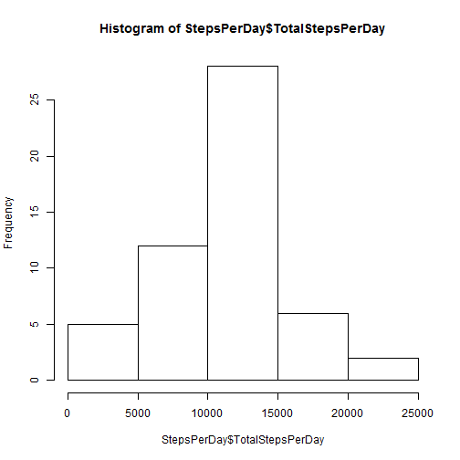
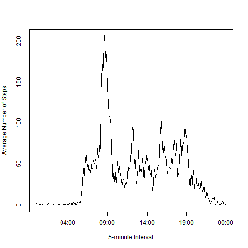
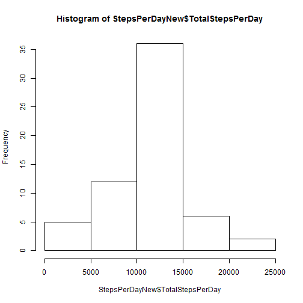
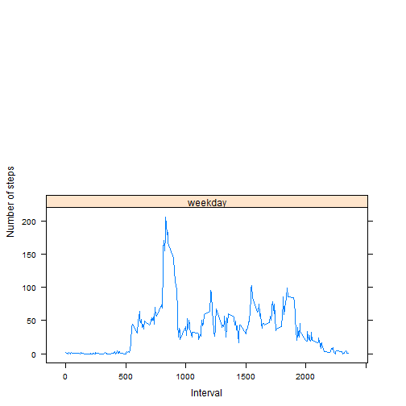

**Task 0: Loading and preprocessing the data**

0.1 Load the data


```r
data<-read.csv("activity.csv")
```

Take a look at the data


```r
str(data)
```

```
## 'data.frame':	17568 obs. of  3 variables:
##  $ steps   : int  NA NA NA NA NA NA NA NA NA NA ...
##  $ date    : Factor w/ 61 levels "2012-10-01","2012-10-02",..: 1 1 1 1 1 1 1 1 1 1 ...
##  $ interval: int  0 5 10 15 20 25 30 35 40 45 ...
```


```r
head(data)
```

```
##   steps       date interval
## 1    NA 2012-10-01        0
## 2    NA 2012-10-01        5
## 3    NA 2012-10-01       10
## 4    NA 2012-10-01       15
## 5    NA 2012-10-01       20
## 6    NA 2012-10-01       25
```

Things we noticed: 

1. The steps field has a lot of missing values.

2. The date field is of class factor.

 
**Task 1: What is mean total number of steps taken per day? (can ignore the missing values in the dataset)**

1.1 Make a histogram of the total number of steps taken each day

First we need to sum the total number of steps taken each day. We can use the ddply function in the plyr package to calculate factor sums.


```r
library(plyr)
StepsPerDay<-ddply(data, .(date), summarize, TotalStepsPerDay = sum(steps))
str(StepsPerDay)
```

```
## 'data.frame':	61 obs. of  2 variables:
##  $ date            : Factor w/ 61 levels "2012-10-01","2012-10-02",..: 1 2 3 4 5 6 7 8 9 10 ...
##  $ TotalStepsPerDay: int  NA 126 11352 12116 13294 15420 11015 NA 12811 9900 ...
```

We can see that there are 61 observations which match our data of months of October and November (61 days in total). Also the first day's sum is NA, which match what we saw for the data.

Now plot the histogram.


```r
hist(StepsPerDay$TotalStepsPerDay)
```

 

1.2 Calculate and report the mean and median total number of steps taken per day

Mean:


```r
mean(StepsPerDay$TotalStepsPerDay, na.rm = TRUE)
```

```
## [1] 10766.19
```

Median:


```r
median(StepsPerDay$TotalStepsPerDay, na.rm = TRUE)
```

```
## [1] 10765
```


**Task 2: What is the average daily activity pattern?**

2.1 Make a time series plot (i.e. type = "l") of the 5-minute interval (x-axis) and the average number of steps taken, averaged across all days (y-axis)

We can use the ddply function to calculate the average.


```r
StepsByInterval<-ddply(data, .(interval), summarize, AvgStep = mean(steps, na.rm = TRUE))
```

If we take a closer look at the StepsByInterval:


```r
head(StepsByInterval, n = 15)
```

```
##    interval   AvgStep
## 1         0 1.7169811
## 2         5 0.3396226
## 3        10 0.1320755
## 4        15 0.1509434
## 5        20 0.0754717
## 6        25 2.0943396
## 7        30 0.5283019
## 8        35 0.8679245
## 9        40 0.0000000
## 10       45 1.4716981
## 11       50 0.3018868
## 12       55 0.1320755
## 13      100 0.3207547
## 14      105 0.6792453
## 15      110 0.1509434
```

We can see that the 5-minute interval is in 24-hour clock format. So we need to transform it into time format.


```r
StepsByInterval$intervalTrans<-sprintf("%04d", StepsByInterval$interval)
StepsByInterval$intervalTrans<-strptime(StepsByInterval$intervalTrans, "%H%M")
```

Now plot:


```r
with(StepsByInterval, plot(intervalTrans, AvgStep, type = "l", xlab = "5-minute Interval", ylab = "Average Number of Steps"))
```

 

2.2 Which 5-minute interval, on average across all the days in the dataset, contains the maximum number of steps?

If we look at the transformed StepsByInterval data frame:


```r
head(StepsByInterval)
```

```
##   interval   AvgStep       intervalTrans
## 1        0 1.7169811 2015-08-16 00:00:00
## 2        5 0.3396226 2015-08-16 00:05:00
## 3       10 0.1320755 2015-08-16 00:10:00
## 4       15 0.1509434 2015-08-16 00:15:00
## 5       20 0.0754717 2015-08-16 00:20:00
## 6       25 2.0943396 2015-08-16 00:25:00
```

We notice that the intervalTrans is using today's date by default. Although this does not matter when we plot in the above step, we need to take out that date and just keep the time.


```r
StepsByInterval$intervalTrans<-strftime(StepsByInterval$intervalTrans, format="%H:%M:%S")
StepsByInterval[StepsByInterval$AvgStep == max(StepsByInterval$AvgStep),]
```

```
##     interval  AvgStep intervalTrans
## 104      835 206.1698      08:35:00
```

So interval 835 (08:35) conatins the maximum number of steps on average.

**Task 3: Imputing missing values**

3.1 Calculate and report the total number of missing values in the dataset (i.e. the total number of rows with NAs)


```r
sum(is.na(data$steps))
```

```
## [1] 2304
```

So the total number of rows with NAs is 2304.

3.2 Devise a strategy for filling in all of the missing values in the dataset. The strategy does not need to be sophisticated. For example, you could use the mean/median for that day, or the mean for that 5-minute interval, etc.

First, let's fill the days that have NAs for all intervals using the mean for each interval. We can make use the StepsByInterval data frame from the previous task.


```r
dataNew<-data
for (i in 1:nrow(dataNew)) {
        if (is.na(dataNew[i,1])) {
                dataNew[i,1]<-StepsByInterval[StepsByInterval[,1]==dataNew[i,3],2]}
}
```

Let's check for NAs in steps again and see if we have filled all the rows.


```r
sum(is.na(dataNew$steps))
```

```
## [1] 0
```

Indeed, we have filled missing data in all the rows.

3.3 Create a new dataset that is equal to the original dataset but with the missing data filled in.

dataNew created above is the new dataset. We can take a look at it.


```r
str(dataNew)
```

```
## 'data.frame':	17568 obs. of  3 variables:
##  $ steps   : num  1.717 0.3396 0.1321 0.1509 0.0755 ...
##  $ date    : Factor w/ 61 levels "2012-10-01","2012-10-02",..: 1 1 1 1 1 1 1 1 1 1 ...
##  $ interval: int  0 5 10 15 20 25 30 35 40 45 ...
```

3.4 Make a histogram of the total number of steps taken each day and Calculate and report the mean and median total number of steps taken per day. Do these values differ from the estimates from the first part of the assignment? What is the impact of imputing missing data on the estimates of the total daily number of steps?

We will repeat what we do in task 1 using the new dataset.


```r
StepsPerDayNew<-ddply(dataNew, .(date), summarize, TotalStepsPerDay = sum(steps))
hist(StepsPerDayNew$TotalStepsPerDay)
```

 

Mean:


```r
mean(StepsPerDayNew$TotalStepsPerDay)
```

```
## [1] 10766.19
```

Median:


```r
median(StepsPerDayNew$TotalStepsPerDay)
```

```
## [1] 10766.19
```

The height of the bars in the historgram increase since we filled the missing values. However the mean remain same because we use the mean steps of each interval to fill the missing values. For the same reason, median remain almost the same as well.

**Task 4: Are there differences in activity patterns between weekdays and weekends?**

4.1 Create a new factor variable in the dataset with two levels -- "weekday" and "weekend" indicating whether a given date is a weekday or weekend day.

First let's add the new factor using the weekdays function.


```r
for ( i in 1:nrow(dataNew)) {
        if (weekdays(strptime(dataNew[i,2], "%Y-%m-%d")) %in% c("Saturday", "Sunday")) {
                dataNew[i,4]<-"weekend"
        }
        else {dataNew[i,4]<-"weekday"}
}
names(dataNew)[4]<-"DayInd"
```

Take a look.


```r
head(dataNew)
```

```
##       steps       date interval  DayInd
## 1 1.7169811 2012-10-01        0 weekday
## 2 0.3396226 2012-10-01        5 weekday
## 3 0.1320755 2012-10-01       10 weekday
## 4 0.1509434 2012-10-01       15 weekday
## 5 0.0754717 2012-10-01       20 weekday
## 6 2.0943396 2012-10-01       25 weekday
```

4.2 Make a panel plot containing a time series plot (i.e. type = "l") of the 5-minute interval (x-axis) and the average number of steps taken, averaged across all weekday days or weekend days (y-axis).

We will use the similar method to calculate.


```r
StepsWeekday<-ddply(dataNew, .(interval,DayInd), summarize, AvgStep = mean(steps))
```

Let's use lattice to plot the panel plot.


```r
library(lattice)
xyplot(AvgStep ~ interval | DayInd, data = StepsWeekday, layout = c(1, 2), type = "l", xlab = "Interval",ylab = "Number of steps")
```

 
